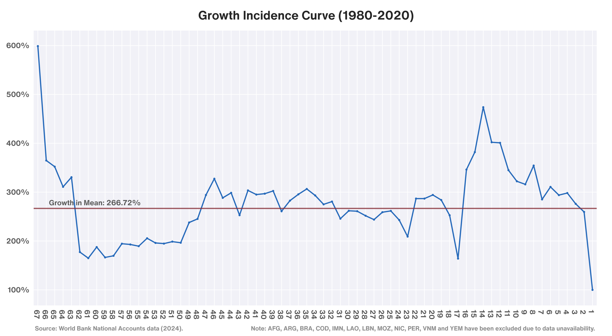
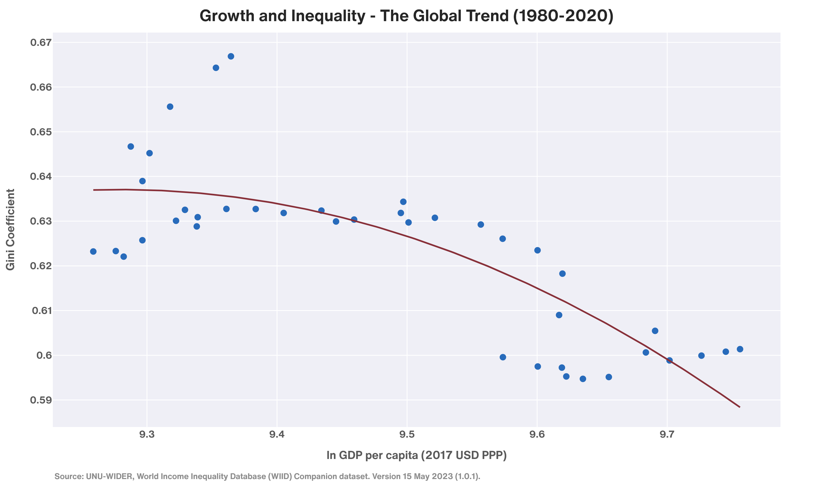
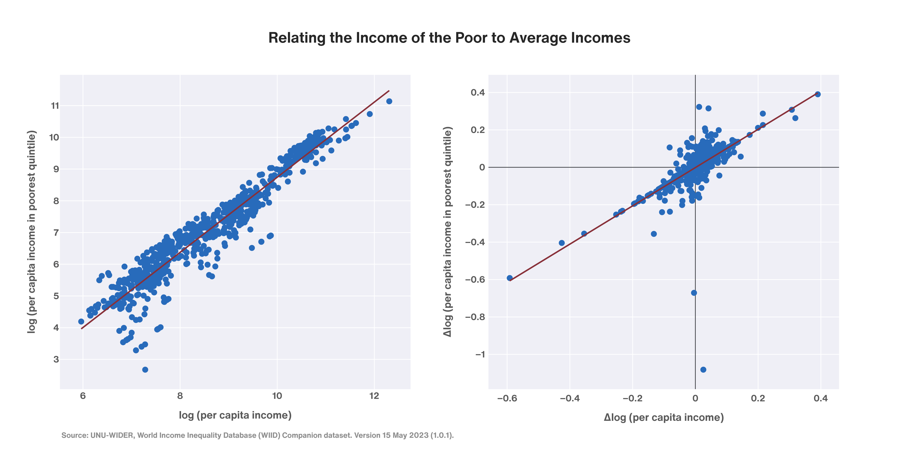
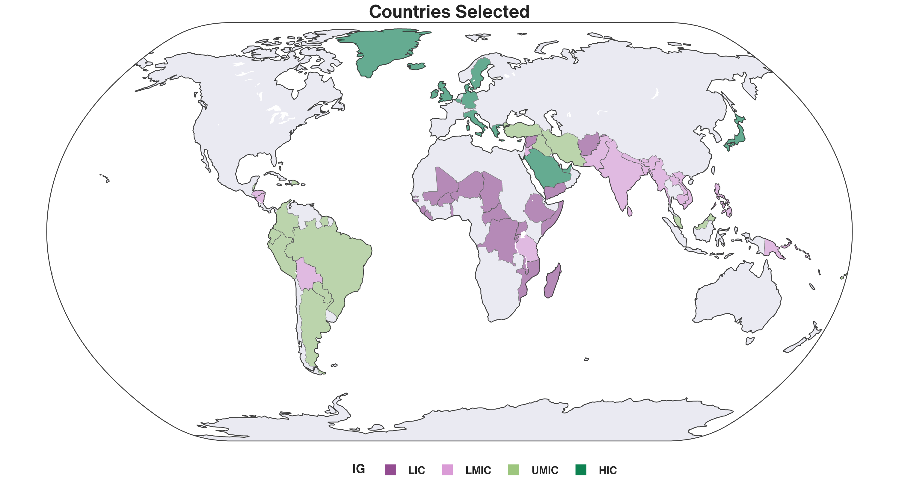

# Prosperity and Parity: A Global Development Trajectories Analysis

## Introduction
This project, titled _Prosperity and Parity_, explores the relationship between economic growth, income inequality, and poverty reduction across 77 countries from 1980 to 2020. Using data from the World Bank's World Development Indicators and the Poverty and Inequality Platform, we analyze income mobility, growth incidence curves, and the effectiveness of economic growth in reducing poverty. The study incorporates methodologies such as **Dollar-Kraay regressions**, the **Kuznets Curve hypothesis**, and **Growth Incidence Curves (GICs)** to provide insights into the inclusivity of growth and its impact on disadvantaged populations.

## Motivation
Economic growth is often celebrated as a mechanism for poverty reduction, but its benefits are not evenly distributed. This project aims to challenge traditional narratives in development economics by focusing on a diverse sample of countries, including underrepresented low- and middle-income nations. By examining income mobility, inequality, and poverty, we hope to contribute to the discourse on equitable growth strategies and highlight the importance of inclusive development for sustainable progress.

## Key Questions
1. How does economic growth affect income mobility across different income groups and regions?
2. What is the relationship between economic growth and poverty reduction, particularly for the poorest segments of the population?
3. Does the Kuznets Curve hypothesis hold true for a diverse sample of countries?
4. How do regional and structural factors influence the inclusivity of economic growth?

## Methodology
### Data Sources
- **World Bank World Development Indicators**: Used for GDP per capita, income classifications, and poverty metrics.
- **World Bank Poverty and Inequality Platform**: Provided data on inequality (Gini coefficients) and poverty measures (Headcount Ratio, Watt’s Index).
- **United Nations World Income Inequality Database**: Provided additional and more frequent time series data on income distributions.

### Analytical Techniques
1. **Country Selection**:
   - Compiled a list of 160 feasible countries based on data availability.
   - Used **integer programming** to select 77 countries based on income groups and regions, ensuring economic and geographic diversity.
   - The selection criteria included:
     - **Income Groups**: 21 low-income, 22 lower-middle-income, 18 upper-middle-income, and 16 high-income countries.
     - **Regions**: 25 Asian, 19 African, 12 European, 6 North American, 8 South American, and 7 Oceanian nations.
   - The goal was to ensure a representative sample of countries while maintaining data availability and consistency.

2. **Growth Incidence Curves (GICs)**:
   - Constructed GICs to analyse changes in income distribution over time.
   - Countries were sorted by GDP per capita (lowest to highest) for the years 1980 and 2020, and the growth rate of GDP per capita was plotted against income percentiles.

3. **Kuznets Curve (Park & Brat Methodology)**:
   - Adapted Park & Brat’s (1995) methodology to compute a cross-national Gini series.
   - Calculated the mean per capita real GDP across all countries in 2017 PPP USD terms and normalised each country's GDP by dividing it by the annual global mean.
   - Derived the Gini coefficient by calculating twice the covariance between normalised ranks and standardised income levels (Lerman & Yitzhaki, 1985).

4. **Dollar-Kraay Regressions**:
   - Tested the relationship between average incomes and the incomes of the poorest quintile and decile, and whether growth is 'pro-poor'
   - Performed robustness checks by incorporating policy variables such as government expenditure on healthcare, education, trade openness, and urbanisation.

5. **Data Visualization**:
   - Created visualisations (e.g., world maps, scatter plots) to communicate findings effectively.

### Technologies Used
This project made extensive use of the following technologies:

*   **Python Libraries:**
      *   **pandas & Polars:** For data manipulation and analysis (pandas for medium datasets, and Polars for larger datasets)
      *   **plotly:** For creating interactive and static data visualisations.
      *   **statsmodels:** For linear regression analysis.
      *   **PuLP:** For formulating and solving the integer programming problem for country selection.
*   **Other Technologies**
      *   **Excel:** Data wrangling was done using Excel.

### My Contributions
- **Dataset Compilation**: Compiled and cleaned all datasets, ensuring data availability and consistency for the analysis.
- **Country Selection**: Designed and implemented an integer programming model to select 77 countries based on income groups and regions.
- **Growth Incidence Curves (GICs)**: Constructed GICs to analyse income distribution changes.
- **Kuznets Curve Analysis**: Adapted Park & Brat’s methodology to compute a cross-national Gini series to construct a 'global' Kuznets Curve and analyse global inequality trends.
- **Dollar-Kraay Regressions**: Performed initial regressions to test the relationship between average incomes and the incomes of the poorest quintile and decile. Contructed a larger dataset with 
- **Data Visualisation**: Created visualisations (e.g., world maps, scatter plots) to communicate findings effectively.

### Teammates' Contributions
While this repository focuses on my contributions, the broader project also included:
- **Income Mobility Matrices**: Analysed income mobility across three time periods (1980-2000, 2000-2020, 1980-2020).
- **Inequality and Poverty Analysis**: Examined the relationship between inequality (Gini coefficients) and poverty (Watt’s Index, Headcount Ratios) across income groups.
- **Dollar-Kraay Regressions with Controls**: Performed robustness checks and regional analyses to test the inclusivity of economic growth.

## Technologies Used
- **Python**: For data analysis, integer programming, and visualisation.
  - **pandas & Polars:** For data manipulation and analysis (pandas for medium datasets, and Polars for larger datasets)
  - **plotly:** For creating interactive and static data visualizations.
  - **statsmodels:** For linear regression analysis.
  - **PuLP:** For formulating and solving the integer programming problem for country selection.
- **Excel**: For data wrangling and additional visualisations
- **Jupyter Notebooks**: For documenting and sharing the analysis.

## Key Findings
### Growth Incidence Curves (GICs)

   - Lower-income countries experienced significant percentage growth in GDP per capita, driven by their low initial income base. For example, some countries saw growth rates of up to 600% over the 1980-2020 period.
   - Middle-income countries grew at rates close to the global average, while high-income countries showed slower growth, with some even experiencing declines in the highest income brackets.
   - The period 2000-2020 showed stronger pro-poor growth compared to 1980-2000, likely due to reduced global political tensions and increased economic liberalisation.

### Kuznets Curve and Global Inequality Trends

   - The Kuznets Curve hypothesis was partially supported: inequality initially increased and then decreased in middle-income countries, but this trend was less evident in low- and high-income contexts.
   - Global inequality, as measured by a cross-national Gini coefficient, showed a consistent downward trend from 1980 to 2020, suggesting income convergence between richer and poorer nations.

### Dollar-Kraay Regressions

   - Economic growth positively impacted the incomes of the poorest quintile and decile, with slope coefficients close to 1, indicating proportional income gains for the poor.
   - Robustness checks revealed that factors such as government expenditure on healthcare and education positively influenced low-income productivity, while higher inequality (Gini coefficient) restricted wealth distribution to the poor.
   - The relationship between growth and the incomes of the poor was weaker in Africa compared to other regions, highlighting structural challenges in translating growth into poverty reduction.

### Country Selection

- The integer programming model successfully selected a diverse and representative sample of 77 countries, ensuring balanced representation across income groups and regions.
- This approach allowed for a comprehensive analysis of development trajectories, highlighting challenges faced by low- and middle-income nations.

### Data-Driven Insights
   - The analysis highlighted the importance of inclusive growth policies, particularly for low- and middle-income countries, where structural barriers and uneven globalisation often limit the benefits of economic growth.
   - Visualisations such as world maps and scatter plots effectively communicated the distribution of economic growth and inequality, providing actionable insights for policymakers.

## File Structure
*   `data/`: Contains the raw data and cleaned, processed data used in the project.
*   `notebooks/`: Jupyter notebooks containing all of the analysis steps.
*   `images/`: Output graphs and maps of the selected countries.
*   `requirements.txt`: Python libraries needed to run the notebooks.

## How to Reproduce
1. Install dependencies: `pip install -r requirements.txt`.
2. Open and run the notebooks in the `notebooks` folder in order (`01_country_selection.ipynb` first, etc.).

## Full Report
The full report was submitted to our professor as part of the course requirements. While it is not included in this repository, the code and methodologies used for my contributions are fully documented here.

*This project was completed as part of a college course in Development Economics (ECON05C12).*

## License
This project is licensed under the MIT License.